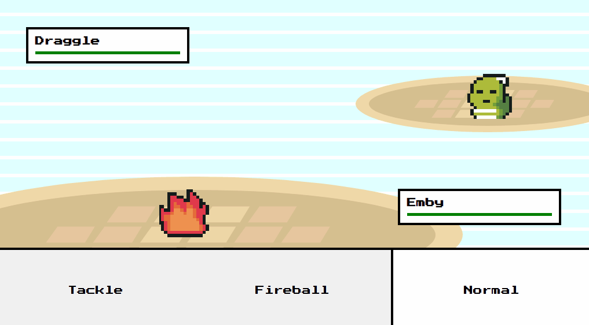

# Bashing Li'l Monsters

_Languages:_ 
 
- 🌎 Também disponível em pt-BR aqui 👉 [Aqui](https://github.com/paulomonezi/clashinglilmonsters/blob/main/README.ptBR.md)

  
Welcome, stay awhile and listen :)

   

## 💻 What is this project about?

It's about developing a _2d top-down game pokemon-like (gb/gba) turn-based_, from scrach. The main goal was pratice (a lot) of programming logic, solving a lot of problems and issues that i never had a chance to think about before, but all of this, in a fun way.

## 🕹️ How to Play?
-  🔗 **Link**:  
👉 https://paulomonezi.github.io/bashing-lil-monsters/   
-  🮠**Commands**:  
Use ASDW key to move around, explore the map and when you feel ready, step on the higher grass (the darker one) to encounter the battle. 
Click on any attack to fight with your opponent  
- 🥳 **Have Fun!**  

## 🧰 Tech Stack
- Assets from https://itch.io/game-assets
- Tiled - _to create map layers_
- HTML Canvas
- Sass
- Javascript
- GSAP - _to work with animation_
- howler.js - _to work with sounds_
 

## 💭 Wich difficulties i've passed through?

The project was made literally from scratch, so, here we go:
#### - Become familiar with spritesheets.
Spritesheets are pretty common on these kind of games, absolutely bread and butter. But was kinda challenging to think about how to render the character sprite properly, how to create boundaries on the edges of the map, and implement battlezones (aka high grass hehe).

#### - Make the whole map-battle-map transition
This one was initially fairly challenging because switching between a battle scene and the map was a little bit more complex than i though, stop all animations related to map and start to render a new scene, with new sprites, attacks and etc. 
Finishing the battle and back to the main map, making sure of restarting every single variable related to battles before we encounter another battle.
GSAPjs lb was pretty useful here :D

## 🧠 What i've learned
Besides those mentions up there. 
Make scalable and solid code, wich is a awesome time saving on the future. 
For example, if i want to add new attacks, i can just create a new animation, add the attacks properties on `attacks.js` and assign to any monster that i want. This is automatically populate the attack buttons when i've enter a battle, just awesome!

### 🙏 Special Thanks
Huge special thanks to Chris, from https://chriscourses.com to teach me all the stuff i've learned on this project. 
Link to this tutorial: https://www.youtube.com/watch?v=yP5DKzriqXA  
You rock, Chris!

#### 🎵 Yes, on battle ending, that is Victory Fanfare from FF VII!

### 🔋 WIP
I'm still working on this project, planning to add more random wild encounters, plenty of attacks, effectiveness and etc.
