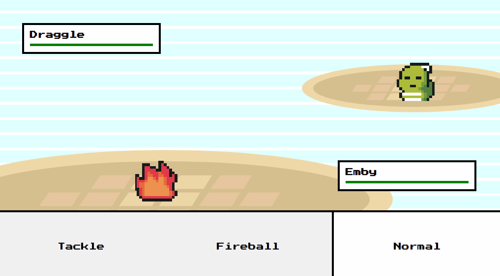

# Bashing Li'l Monsters

_Languages:_ 
 
- Also avaliable in english 👉 [Here](https://github.com/paulomonezi/clashinglilmonsters/blob/ce2e3b91b18d306d84c23fda857c77d3a144f09b/README.md)

  
_Welcome, stay awhile and listen :)_

   

## Sobre o que é esse projeto?

É um projeto sobre desenvolvimento de um jogo _2d em turnos, estilo pokemon de gameboy/gameboy advanced_, do zero. O objetivo principal aqui foi praticar (bastante) lógica de programação, resolvendo vários questões e problemas que eu nunca tive a chance de pensar sobre, mas, tudo isso de uma maneira muito legal.

## Como jogar?
-  **Link**:  
👉 https://paulomonezi.github.io/bashing-lil-monsters/   
-  **Controles**:  
Use as teclas ASDW para se mover, explore o mapa, e quando se sentir pronto, ande sobre a grama alta (a mais escura). 
Em batalha, escolha o ataque e clique para executar a ação  
- **Divirta-se!**  

## Techs usadas
- Assets from https://itch.io/game-assets
- Tiled _to create map layers_
- HTML Canvas
- Sass
- Javascript
- GSAP - _para trabalhar com as animações_
- howler.js - _para trabalhar com os efeitos sonoros/música_
 

## Quais foram as dificuldades encontradas?

Como dito anteriormente, o projeto foi feito do zero, então precisei praticamente codar uma 'mini-engine':
#### - Aprender como trabalhar com spritesheets.
Spritesheets são bem comuns nesse tipo de jogo, já que a animação geralmente é baseada nisso. Mas pensar em como renderizar o sprite do jogador de mandeira correta, foi muito desafiador, como criar os limites nas bordas do mapa, e também as zonas de batalha.

#### - Criar a transição de mapa-batalha-mapa
Essa aqui foi bem difícil no começo, transicionar do mapa para a batalha foi um pouquinho mais complexo do que eu imaginava, parar todas as animações
envolvidas ao mapa e renderizar a nova cena, de batalha, com os sprites, barra de ataques e etc.
Finalizando a batalha e voltando ao mapa principal, sempre me certificando de reiniciar todas as variáveis necessárias para acessar o mapa normalmente, e também entrar de novo numa batalha futura. a lib do GSAPjs foi bem útil aqui :D

## O que eu aprendi
Além do que eu mencionei acima. 
Criar um código escalonável e sólido, que vai me poupar muito tempo no futuro, quando precisar fazer novas adições!. 
Por exemplo, se eu quero adicionar novos ataques, é só eu criar uma nova animação, adicionar as propriedades desse ataque no `attacks.js` e designar esse ataque pra qualquer monstro que eu quiser. Isso vai automaticamente popular os botões de ataque quando eu entrar na batalha, muito bom haha!

### Agradecimentos especiais
Agradecimento imenso ao Chris, do https://chriscourses.com Por me ensinar todas as coisas que aprendi com esse projeto. 
Link para esse tutorial: https://www.youtube.com/watch?v=yP5DKzriqXA  
Valeu, Chris!

#### Sim, no final da batalha você escuta Victory Fanfare do FF VII!

### WIP
Esse é um projeto que ainda está em desenvolvimento, tenho planos para adicionar mais encontros com monstros, vários novos ataques, efetividades e etc.
